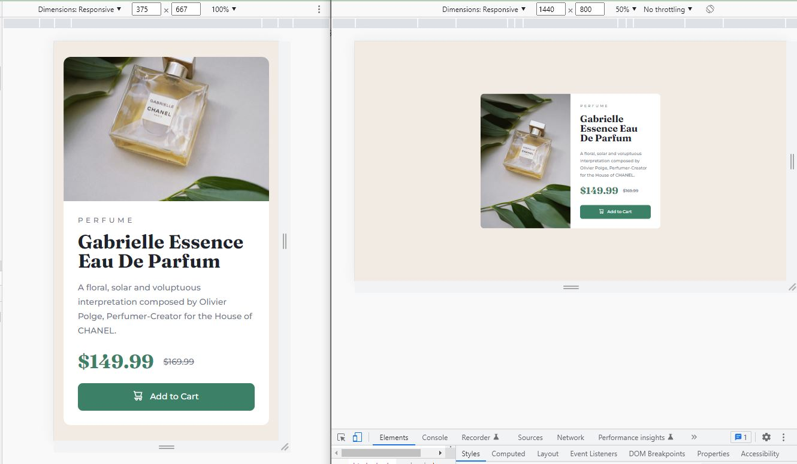

# Frontend Mentor - Product preview card component solution

This is a solution to the [Product preview card component challenge on Frontend Mentor](https://www.frontendmentor.io/challenges/product-preview-card-component-GO7UmttRfa)

## Table of contents

- [Overview](#overview)
  - [The challenge](#the-challenge)
  - [Screenshot](#screenshot)
  - [Links](#links)
- [My process](#my-process)
  - [Workflow](#workflow)
  - [Built with](#built-with)
  - [What I learned](#what-i-learned)
  - [Continued development](#continued-development)
  - [Useful resources](#useful-resources)
- [Author](#author)
- [Acknowledgments](#acknowledgments)

## Overview

### The challenge

Users should be able to:

- View the optimal layout depending on their device's screen size
- See hover and focus states for interactive elements

### Screenshot

### Links

- Solution: [frontendmentor.io](https://your-solution-url.com)
- Live Site: [github.io](https://siavhnz.github.io/frontendmentor/4.product-preview-card/index.html)

## My process

### Workflow

- Create the HTML5 skeleton based on the mobile-design.jpg file in the assets/design folder.
- Install tailwindcss
- Mobile-first design
- Desktop design
- Publish solution on github.io
- Push solution on github.com

### Built with

- Semantic HTML5 markup
- Mobile-first workflow
- Tailwindcss
- Flexbox in mobile resolutions
- CSS Grid in desktop resolution

### What I learned

I learned how to arrange a simple product box with the Grid layout.

### Continued development

I need more practice to grasp the whole Grid layout system and use it in further challenges.

### Useful resources

- [Grid layout](https://www.example.com) - This helped me for XYZ reason. I really liked this pattern and will use it going forward.

## Author

- Frontend Mentor - [@siavhnz](https://www.frontendmentor.io/profile/siavhnz)

## Acknowledgments

[Frontendmentor.io](https://www.frontendmentor.io/challenges) for their Excitement challenges  

[Perfect Pixel](https://chrome.google.com/webstore/detail/perfectpixel-by-welldonec/dkaagdgjmgdmbnecmcefdhjekcoceebi?hl=en) for such a great extension
